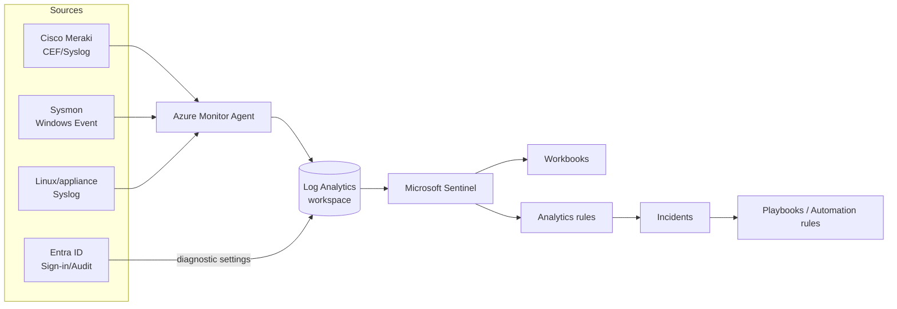

# Sentinel Monitoring — Threat-Hunting Pack

> Import-ready Microsoft Sentinel + Entra ID threat-hunting content for a fresh environment: **29 workbooks** (9 MITRE ATT&CK-mapped + a 20-workbook Azure network observability pack), scheduled analytics rules, Sentinel-native SOAR automation, and hunting queries.


## What's inside

| Area | Folder | Count |
|------|--------|-------|
| 📊 Workbooks (visual hunting dashboards) | [`workbooks/`](workbooks/) | 29 |
| 🚨 Scheduled analytics rules (ARM) | [`analytics-rules/`](analytics-rules/) | 5 |
| 🤖 SOAR playbooks + automation (Sentinel-native) | [`playbooks/`](playbooks/) | 2 + guide |
| 🔎 Scheduled hunting queries | [`hunting-queries/`](hunting-queries/) | 3 |
| 🆔 Entra ID setup & hardening | [`entra/`](entra/) | config + guide |
| 📚 Docs | [`docs/`](docs/) | deployment, blue-team, SOAR, MITRE |

## The 9 workbooks

| # | Workbook | Focus | Key ATT&CK |
|---|----------|-------|-----------|
| 01 | Meraki Network Anomaly | Cisco Meraki flow anomalies, port scans, C2/exfil | T1046, T1071 |
| 02 | Anomalous / Impossible Travel | Sign-in geo on **Azure Maps** + speed calc | T1078 |
| 03 | Sysmon Process Hunting | Encoded PowerShell, LOLBins, cred access | T1059, T1218, T1003 |
| 04 | Syslog Monitoring | Facility/severity baselining, auth failures | T1078 |
| 05 | Entra Identity Compromise | Failures, spray, legacy auth, risky sign-ins | T1110, T1556 |
| 06 | Sign-in Risk & CA Gaps | Conditional Access bypass, single-factor logins | T1078, T1556 |
| 07 | Lateral Movement | RDP/SMB fan-out, failed-logon bursts | T1021, T1110 |
| 08 | Persistence & PrivEsc | New accounts, group/role adds, services | T1136, T1098, T1543 |
| 09 | MITRE ATT&CK Coverage | Dashboard of dashboards — blind-spot view | (overview) |

## Azure network observability pack (13–32)

A 20-workbook pack for Azure Monitor network telemetry. See the build spec in
[`docs/azure-monitor-network-workbooks-plan.md`](docs/azure-monitor-network-workbooks-plan.md)
and reusable community references in
[`docs/community-workbooks-research.md`](docs/community-workbooks-research.md).

| # range | Theme | Primary data source(s) |
|---------|-------|------------------------|
| 13–16 | Network availability | `Heartbeat`, `NWConnectionMonitorTestResult`, `AzureDiagnostics`/`AzureMetrics` (gateways) |
| 17–20 | Syslog traffic monitoring | `Syslog` (+ `Heartbeat` for ingestion health) |
| 21–24 | Inter-region egress | `AzureNetworkAnalytics_CL` (Traffic Analytics), `AzureMetrics` |
| 25–28 | Virtual WAN traffic | `AzureDiagnostics` (VIRTUALHUBS / VPNGATEWAYS / EXPRESSROUTEGATEWAYS), `AzureNetworkAnalytics_CL` |
| 29–32 | Windows Firewall deny | `WindowsFirewall` (Drop/Block), `SecurityEvent` (5152/5157/5031/49xx) + `parsers/WindowsFirewallDeny.kql` |

## Quick start

```bash
# 1. Send Entra logs to your workspace (tenant scope)
az deployment tenant create --location <region> \
  --template-file entra/diagnostic-settings.json \
  --parameters workspaceResourceId="<workspace-resource-id>"

# 2. Deploy an analytics rule
az deployment group create --resource-group <rg> \
  --template-file analytics-rules/password-spray.json \
  --parameters workspace=<workspace-name>

# 3. Import a workbook (portal)
#    Sentinel > Workbooks > Add workbook > Edit > Advanced Editor
#    paste the contents of workbooks/0X-*.workbook.json > Apply > Save
```

Full steps in [`docs/deployment.md`](docs/deployment.md).

## Architecture



## Important notes

- **These are starting templates, not pre-tuned detections.** Thresholds (spray counts, travel speed, port-scan limits) must be tuned against *your* telemetry. Each artifact says so.
- **Data source assumptions:** Meraki → `CommonSecurityLog`; Sysmon → `Event`; generic → `Syslog`; Entra → `SigninLogs`/`AuditLogs`/etc. Adjust if your connectors differ.
- **SOAR is Sentinel-native** (Logic Apps + automation rules) — no Cortex XSOAR required.
- **Geo uses Azure Maps**, not the deprecated Bing Maps for Enterprise.

## License

Provided as-is for defensive security use. Review before deploying to production.
