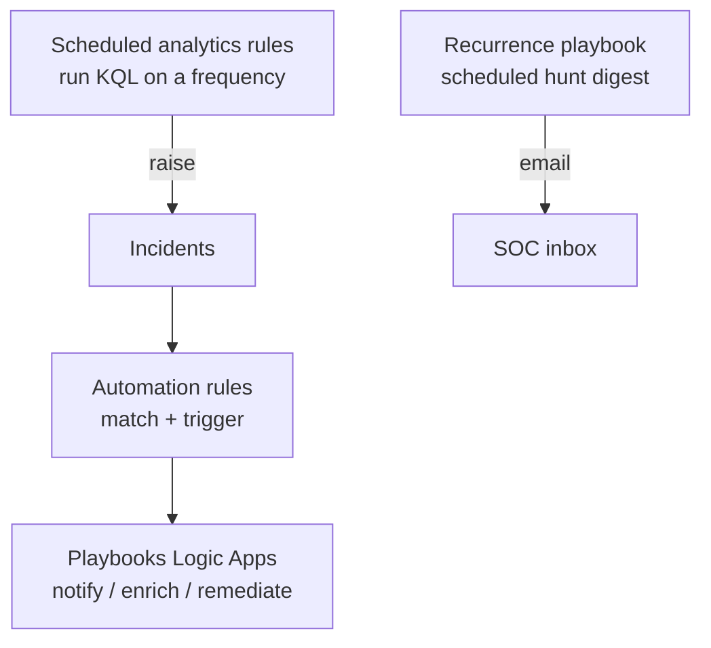

# SOAR Runbook — target, monitor, schedule

How automated targeting, monitoring, and scheduling work in this pack, using **Sentinel-native SOAR** (no Cortex XSOAR).

## The three layers

## 1. Target — what to watch

Targeting lives in each analytics rule's KQL `query` (which users, IPs, hosts, techniques). Scope it tightly; broad rules create noise.

## 2. Monitor — raise & route

- Analytics rules raise **incidents** with severity, tactics, and entity mappings (so the entity graph works).
- **Automation rules** route them: e.g. "High incident → run `Notify-SOC`", "incident tagged `identity` → assign to IAM queue".

## 3. Schedule — run on a cadence

Two scheduling mechanisms:

| Mechanism | Cadence control | Use for |
|-----------|-----------------|---------|
| Analytics rule | `queryFrequency` / `queryPeriod` | Real-time-ish detection → incidents |
| Recurrence playbook (`scheduled-hunt-digest`) | `Recurrence` trigger | Periodic hunts/reports that shouldn't be incidents |

## Operating procedure

1. **Triage** the incident: open the linked workbook for context (e.g. impossible-travel incident → workbook 02).
2. **Enrich:** entity graph, recent sign-ins, related incidents.
3. **Decide:** false positive → tune the rule; true positive → contain.
4. **Contain (with approval):** disable user, revoke sessions, block IP. Remediation playbooks must require human approval before acting — never auto-disable without a gate.
5. **Record:** comment on the incident; feed lessons back into thresholds.

## Safety guardrails

- Remediation playbooks (disable user, isolate host) **require an approval step** — do not enable unattended.
- Least privilege: give each playbook's managed identity only the role it needs (`Sentinel Responder` for incident updates; scoped Graph permissions for identity actions).
- No secrets in templates — webhooks/recipients are deploy-time parameters.
